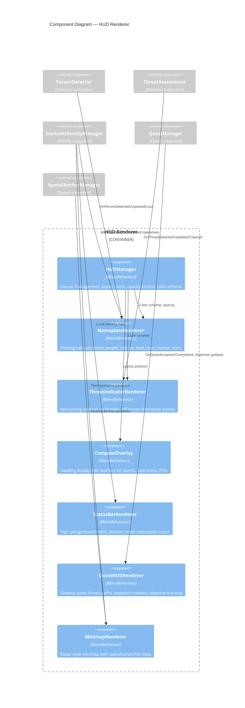
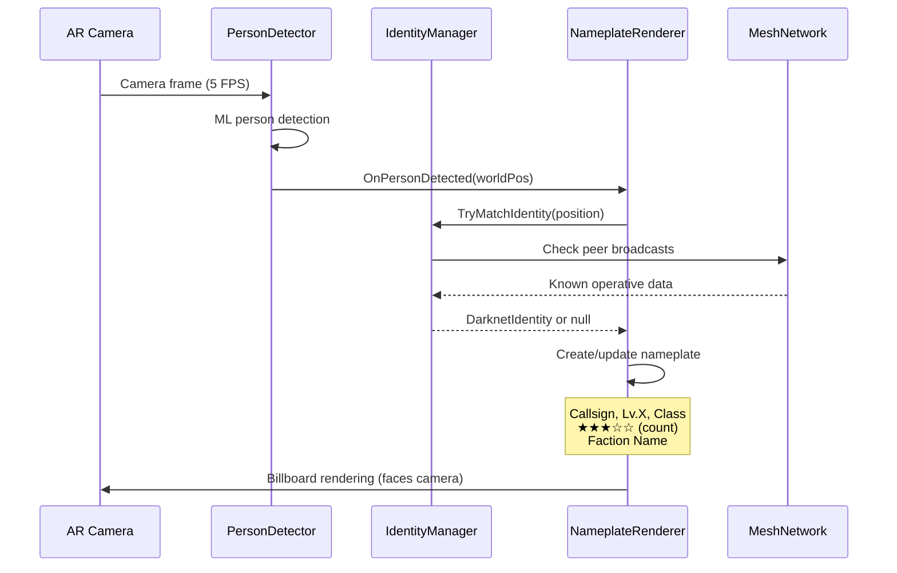

# C4 Model — Level 3: Component Diagram (HUD Renderer)

## Data Flow: Person Detection → Nameplate

## Shader Pipeline

| Shader | Used By | Visual Effect |
|--------|---------|--------------|
| HolographicOverlay | General D-Space panels | Translucent glow + scan lines |
| NameplateShader | Nameplates | Rounded rect + border glow |
| ThreatOutline | Hostile indicators | Red pulsing outline (visible through walls) |
| QuestPath | Quest threads | Flowing golden particles along path |
| DSpaceGrid | Scan mode | Subtle GPS coordinate grid overlay |
