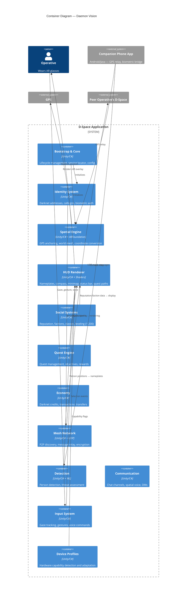

# C4 Model — Level 2: Container Diagram

## Container Responsibilities

| Container | Key Classes | Role |
|-----------|------------|------|
| Bootstrap & Core | DSpaceManager, ServiceLocator, DarknetBootstrap | Lifecycle, DI, subsystem registration |
| Identity | DarknetIdentityManager, BiometricAuth | Who you are in D-Space |
| Spatial | SpatialAnchorManager, GPSLocationProvider | Where things are in the world |
| HUD | HUDManager, NameplateRenderer, CompassOverlay | What you see |
| Social | ReputationSystem, FactionManager, ClassSystem | Your standing and affiliations |
| Quest | QuestManager | What you're doing |
| Economy | DarknetEconomy | What you own |
| Network | MeshNetworkManager, PeerDiscovery, DarknetProtocol | How you communicate |
| Detection | PersonDetector, ThreatAssessment | Who is around you |
| Communication | ChatSystem, VoiceChannelManager | Real-time messaging |
| Input | GazeInput, GestureRecognizer, VoiceCommands | How you interact |
| Profiles | GlassesProfileManager | What your hardware can do |
