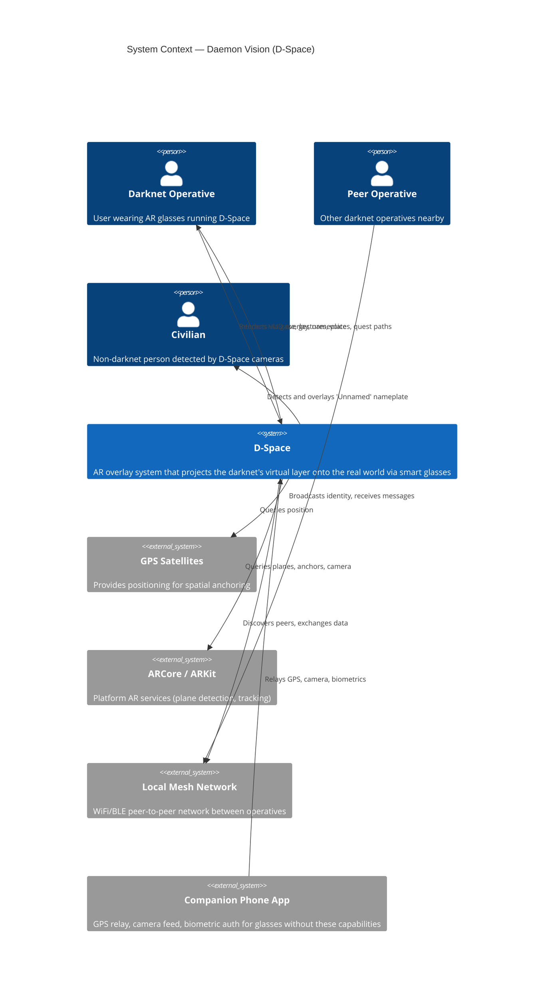

# C4 Model — Level 1: System Context Diagram

## Context Summary

D-Space is a self-contained AR application that:
- Runs on smart glasses or phone
- Overlays a persistent virtual layer (D-Space) on the real world
- Communicates with nearby operatives via mesh networking (no central server)
- Uses GPS for spatial anchoring of virtual objects
- Detects people via camera and overlays darknet identity nameplates
- Optionally pairs with a companion phone for GPS/camera relay
